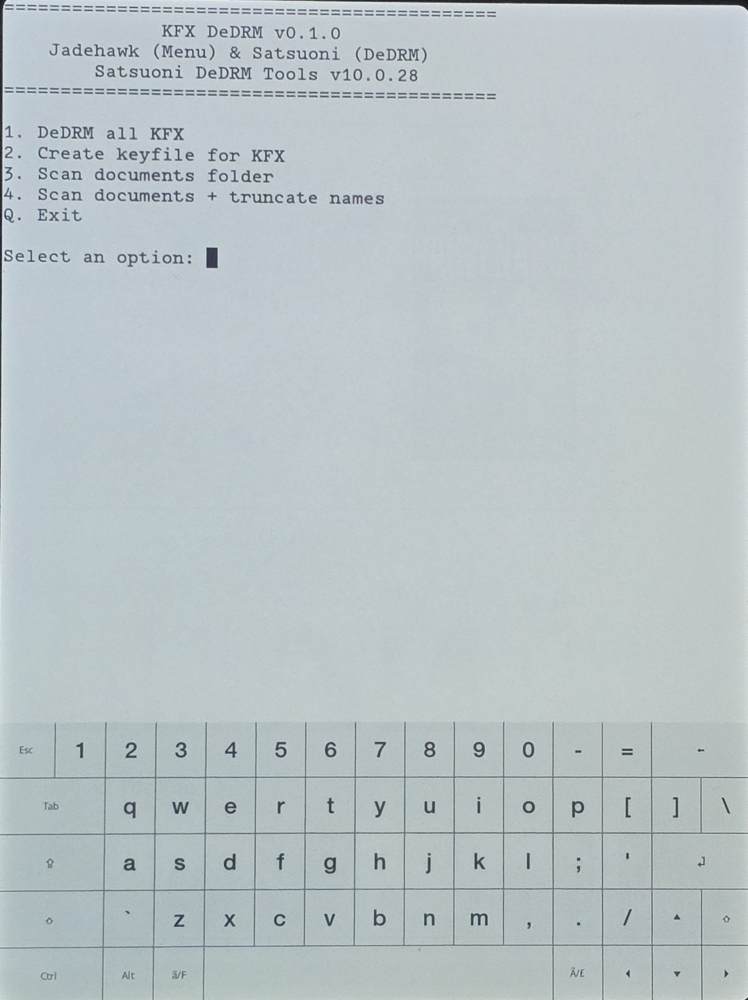

# kfx-dedrm Scriptlet

KUAL-free Kindle Scriptlet wrapper for Satsuoni's KFX DeDRM utility.

The project keeps a single visible `DeDRM KFX` Scriptlet in the Kindle Library while preserving the four actions from the original KUAL menu:

- DeDRM all KFX
- Create keyfile for KFX
- Scan documents folder
- Scan documents folder with truncated names

## Screenshots

### Kindle Library


### KFX DeDRM menu



### DeDRM results


## Repository layout

```text
assets/
└── icon-source.png
src/
├── documents/
│   └── DeDRM KFX.sh
└── kfxdedrm-scriptlet/
    └── bin/
        ├── menu.sh
        ├── run_cmd.sh
        ├── kfxdedrmhf_c11
        ├── kfxdedrmhf_old
        ├── kfxdedrm_c11
        └── kfxdedrm_old
third_party/
└── kterm/
Builds/
VERSION
build.bat
```

`src/` mirrors only the files that belong on the Kindle USB root. The high-resolution icon source is intentionally kept under `assets/` so it is never copied into the Kindle payload.

## Build

Run `build.bat` from Windows. The script reads the release version from `VERSION` and creates:

```text
Builds\kfx-dedrm-v<version>.zip
```

The release ZIP is a complete distribution package. Its layout is:

```text
COPY TO KINDLE ROOT/
├── documents/
├── extensions/
└── kfxdedrm-scriptlet/
LICENSE
README.md
THIRD_PARTY_NOTICES.md
VERSION
licenses/
└── kterm-2.6/
    └── COPYING
source/
└── kterm-2.6/
    └── kterm-v2.6-source.zip
```

Only the contents of `COPY TO KINDLE ROOT` belong on the Kindle. The remaining files are distribution documentation, licensing information, and kterm corresponding source material.

## Install

Open the release ZIP, open **`COPY TO KINDLE ROOT`**, and copy everything inside that folder to the root of the Kindle USB drive. Users do not need to copy `LICENSE`, `README.md`, `THIRD_PARTY_NOTICES.md`, `VERSION`, `licenses/`, or `source/` to the device.

The important resulting Kindle paths are:

```text
/mnt/us/documents/DeDRM KFX.sh
/mnt/us/kfxdedrm-scriptlet/bin/menu.sh
/mnt/us/kfxdedrm-scriptlet/bin/run_cmd.sh
/mnt/us/kfxdedrm-scriptlet/bin/kfxdedrmhf_c11
/mnt/us/kfxdedrm-scriptlet/bin/kfxdedrmhf_old
/mnt/us/kfxdedrm-scriptlet/bin/kfxdedrm_c11
/mnt/us/kfxdedrm-scriptlet/bin/kfxdedrm_old
/mnt/us/extensions/kterm/
```

**This package works only on a jailbroken Kindle with SH_Integration installed and working.** A stock/non-jailbroken Kindle cannot run this Scriptlet. SH_Integration is installed by the Universal Hotfix. The Universal Hotfix is installed automatically by WinterBreak, SpringBreak, and Sanctuary, so Kindles jailbroken with those methods should already have the required integration. If your Kindle was jailbroken using another method, install the Universal Hotfix separately before using KFX DeDRM; see the KindleModding.org [Setting Up A Hotfix](https://kindlemodding.org/jailbreaking/Legacy/post-jailbreak/setting-up-a-hotfix/) guide.

This release bundles the kterm 2.6 ARM hard-float (`armhf`) Kindle build and therefore requires Kindle firmware newer than 5.16.3. Firmware 5.16.3 and earlier require the older non-`armhf` kterm build and are not supported by this release. kterm is installed automatically at `/mnt/us/extensions/kterm`; no separate installation is required. The Scriptlet launches an interactive terminal menu in kterm; choose actions with the on-screen keyboard (`1`-`4`) and use `Q` to exit back to the Kindle Library.

### Tested on

- Kindle Paperwhite Signature Edition (12th Generation) — WinterBreak jailbreak, firmware 5.17.1.0.4

## Scriptlet icon notes

The Kindle Library icon is embedded directly in `DeDRM KFX.sh` as a Base64 PNG using SH_Integration's `# Icon: data:image/png;base64,...` metadata format. The repository keeps the original high-resolution custom artwork at `assets/icon-source.png`; do not overwrite or delete that source image when regenerating the embedded icon. The `assets/` folder is repository-only and is not included in the distribution ZIP.

The currently tested and working icon-generation recipe is:

- Start from `assets/icon-source.png`.
- Resize the artwork to exactly **250 x 391 pixels**.
- Save the resized image as an **8-bit, 24-bit RGB PNG without alpha** (PNG color type 2).
- Base64-encode that resized PNG and place the result after `# Icon: data:image/png;base64,` in `src/documents/DeDRM KFX.sh`.
- Keep the Base64 data on the metadata line and preserve LF line endings in the shell script.

The current working resized PNG is approximately 48 KB before Base64 encoding and about 65,000 Base64 characters. Earlier icon attempts using different image properties failed to display even though the Base64 syntax itself was valid, so the known-working dimensions and RGB PNG format should be preserved unless a new combination is verified on-device.

## Licensing

The original code in this repository is licensed under the GNU General Public License v3.0. Third-party components retain their own terms: the Satsuoni KFX DeDRM binaries are redistributed with permission from Satsuoni, while bundled kterm 2.6 remains GPL-3.0-or-later. See `THIRD_PARTY_NOTICES.md` for details.

The distribution ZIP includes the project license/notices plus kterm's GPL license and corresponding upstream v2.6 source archive outside `COPY TO KINDLE ROOT`, so the user-facing Kindle payload stays clean while the release remains self-contained for distribution. The source archive is the generic kterm 2.6 source tree; `armhf` identifies the compiled Kindle binary package, not a separate source-code edition.

## Upstream binaries

The four `kfxdedrm*` executables are copied unchanged from Satsuoni's `kfxdedrmmobi.zip` v10.0.28 package. The Scriptlet project changes only the launcher/integration layer.
