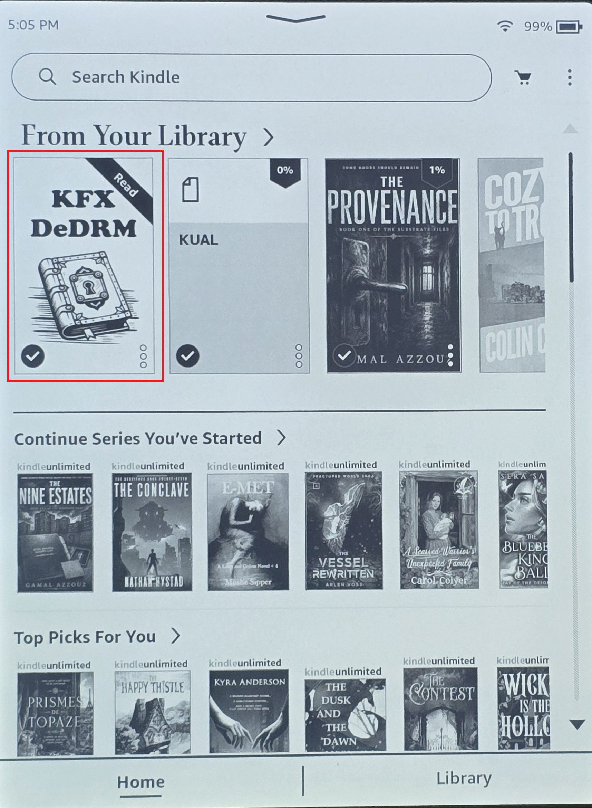
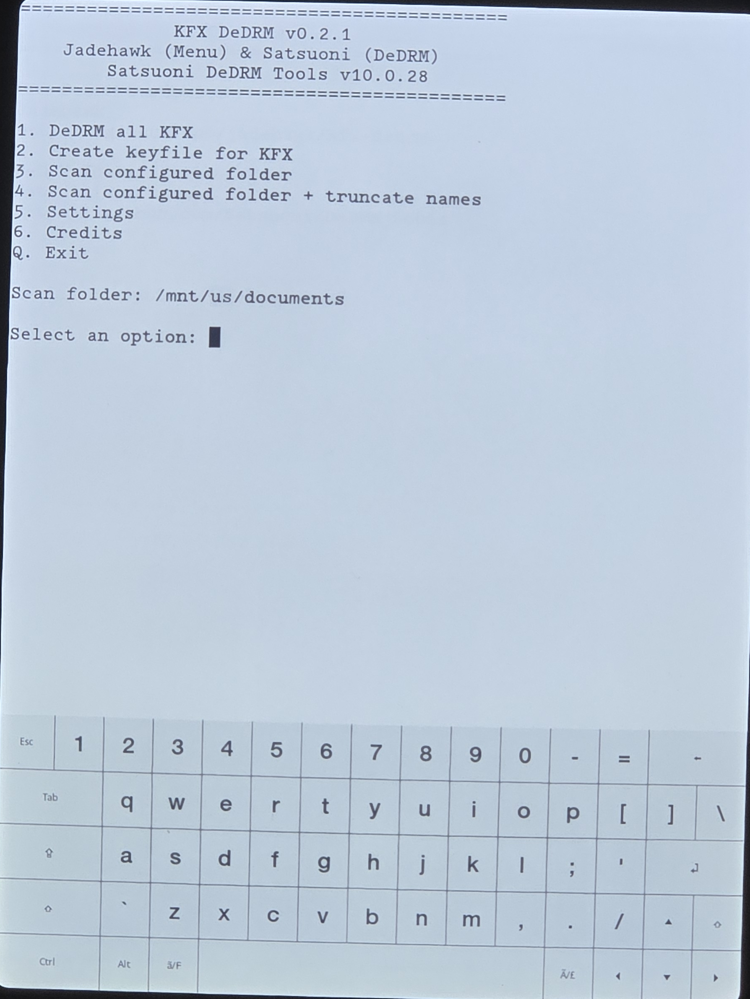
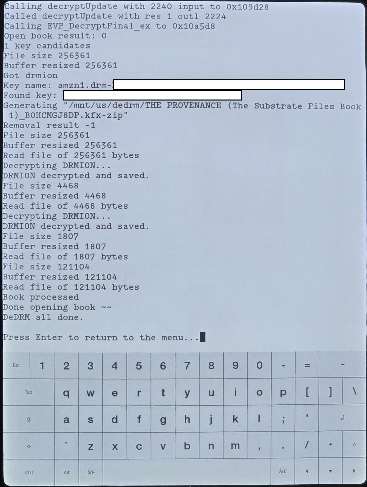
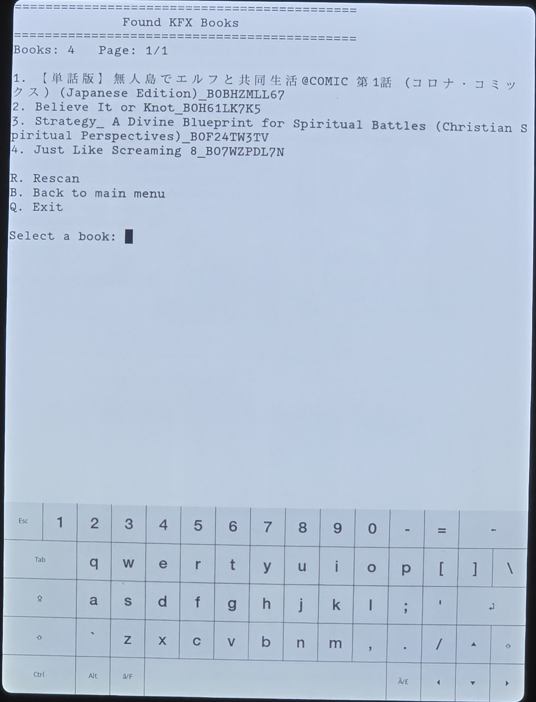
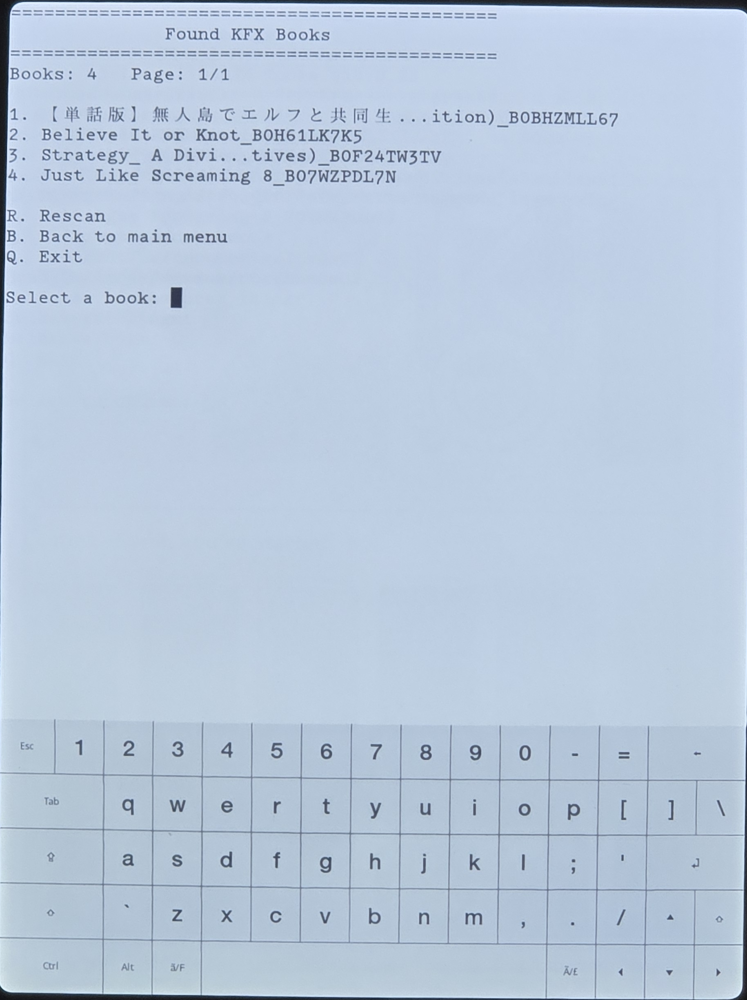
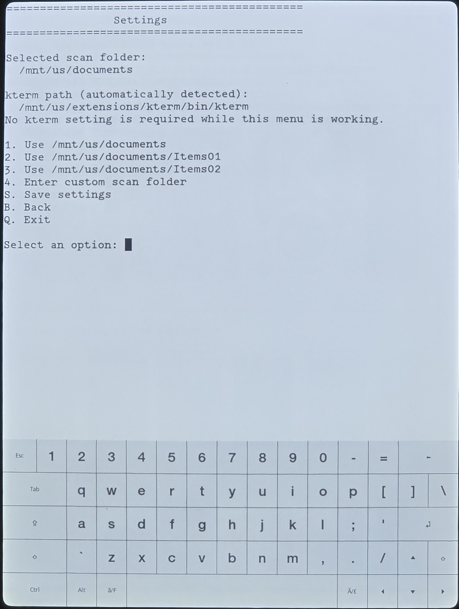

# kfx-dedrm Scriptlet

KUAL-free Kindle Scriptlet wrapper for Satsuoni's KFX DeDRM utility.

Project repository: https://github.com/jadehawk/kfx-dedrm

## v0.2.2 — CURRENT RELEASE

The Scriptlet uses Satsuoni's updated executables, which accept runtime paths for scanning, generated `menu.json`, DeDRM output, and keyfile output. The Scriptlet passes its configured paths directly to the native executable and no longer needs the temporary KUAL `menu.json` compatibility bridge.

**Scan folders are recursive.** If you select `/mnt/us/documents/Downloads`, the scanner also searches folders below it such as `/mnt/us/documents/Downloads/Items01`, `/Items02`, and book-specific subfolders. Selecting a narrower path such as `/mnt/us/documents/Downloads/Items01` limits the scan to that folder and its descendants.

**Current functionality:** automatic executable compatibility probing with the standalone `test` command, launching through SH_Integration/kterm, DeDRM All, keyfile creation, configurable recursive scan roots, configurable DeDRMed-book and keyfile output locations, direct Scriptlet `menu.json` output, scanning and selecting individual books, UTF-8/CJK title display and safe truncation, kterm auto-detection, and the redesigned Settings UI. The Scriptlet installs under `/mnt/us/extensions/kfxdedrm-scriptlet/` and can migrate settings from the previous `/mnt/us/kfxdedrm-scriptlet/` layout.

The project keeps a single visible `KFX DeDRM` Scriptlet in the Kindle Library while preserving the four actions from the original KUAL menu:

- DeDRM all KFX
- Create keyfile for KFX
- Scan documents folder, then choose an individual discovered book to DeDRM
- Scan documents folder with truncated names, then choose an individual discovered book to DeDRM

Options 3 and 4 preserve Satsuoni's original scan behavior, but the generated book list is presented as an interactive paginated kterm menu instead of dynamic KUAL entries. Selecting a book runs the original per-book `dedrm "<book path>"` operation. Option 1 remains available when the user wants to process all KFX books at once.

## Screenshots

### Kindle Library



### KFX DeDRM menu



### DeDRM results



### Scan documents folder



### Scan documents folder with truncated names



### Settings



## Repository layout

```text
assets/
└── icon-source.png
src/
├── documents/
│   └── KFX DeDRM.sh
└── extensions/
    └── kfxdedrm-scriptlet/
        ├── menu.json
        └── bin/
            ├── menu.sh
            ├── run_cmd.sh
            ├── kfxdedrmhf_c11
            ├── kfxdedrmhf_old
            ├── kfxdedrm_c11
            └── kfxdedrm_old
third_party/
├── kterm/
└── satsuoni/
    └── kindle_device/
Builds/
VERSION
build.bat
```

`src/` mirrors only the files that belong on the Kindle USB root. The high-resolution icon source is intentionally kept under `assets/` so it is never copied into the Kindle payload.

## Build

Run `build.bat` from Windows. The script reads the release version from `VERSION` and creates three release packages:

```text
Builds\kfx-dedrm-v<version>-kterm-armhf.zip
Builds\kfx-dedrm-v<version>-kterm-legacy.zip
Builds\kfx-dedrm-v<version>-no-kterm.zip
```

All three ZIPs contain the same KFX DeDRM Scriptlet. The first two bundle kterm 2.6 using the ARMHF or Legacy binary respectively. The `no-kterm` package omits kterm entirely for users who already have a working kterm installation. The release ZIP is a complete distribution package with this layout:

```text
COPY TO KINDLE ROOT/
├── documents/
└── extensions/
    └── kfxdedrm-scriptlet/
LICENSE
README.md
THIRD_PARTY_NOTICES.md
VERSION
licenses/
└── kterm-2.6/
    └── COPYING
source/
├── kterm-2.6/
│   └── kterm-v2.6-source.zip
└── satsuoni-kfx-dedrm-10.0.28-scriptlet/
    └── kindle_device/
```

Only the contents of `COPY TO KINDLE ROOT` belong on the Kindle. The remaining files are distribution documentation, licensing information, and kterm corresponding source material.

## Install

Open the release ZIP, open **`COPY TO KINDLE ROOT`**, and copy everything inside that folder to the root of the Kindle USB drive. Users do not need to copy `LICENSE`, `README.md`, `THIRD_PARTY_NOTICES.md`, `VERSION`, `licenses/`, or `source/` to the device.

The important resulting Kindle paths are:

```text
/mnt/us/documents/KFX DeDRM.sh
/mnt/us/extensions/kfxdedrm-scriptlet/menu.json
/mnt/us/extensions/kfxdedrm-scriptlet/bin/menu.sh
/mnt/us/extensions/kfxdedrm-scriptlet/bin/run_cmd.sh
/mnt/us/extensions/kfxdedrm-scriptlet/bin/kfxdedrmhf_c11
/mnt/us/extensions/kfxdedrm-scriptlet/bin/kfxdedrmhf_old
/mnt/us/extensions/kfxdedrm-scriptlet/bin/kfxdedrm_c11
/mnt/us/extensions/kfxdedrm-scriptlet/bin/kfxdedrm_old
/mnt/us/extensions/kterm/
```

**This package works only on a jailbroken Kindle with SH_Integration installed and working.** A stock/non-jailbroken Kindle cannot run this Scriptlet. SH_Integration is installed by the Universal Hotfix. The Universal Hotfix is installed automatically by WinterBreak, SpringBreak, and Sanctuary, so Kindles jailbroken with those methods should already have the required integration. If your Kindle was jailbroken using another method, install the Universal Hotfix separately before using KFX DeDRM; see the KindleModding.org [Setting Up A Hotfix](https://kindlemodding.org/jailbreaking/Legacy/post-jailbreak/setting-up-a-hotfix/) guide.

Three release packages are provided. Use **`kterm-armhf`** when the ARMHF kterm build works on your Kindle, **`kterm-legacy`** when the non-ARMHF/Legacy kterm build is required, or **`no-kterm`** when you already have a working kterm installation and do not want this package to replace it. The bundled variants install kterm at `/mnt/us/extensions/kterm`.

The Scriptlet can discover kterm in several locations, including `/mnt/us/kterm`, but **kterm must be under `/mnt/us/extensions` for interactive use**. On-device testing showed that moving an otherwise working kterm installation to `/mnt/us/kterm` still allowed the terminal to launch, but the on-screen keyboard disappeared and could not be restored with kterm's keyboard toggle. To avoid trapping the user in a keyboard-less terminal, the launcher now rejects detected kterm binaries outside `/mnt/us/extensions` before starting kterm and writes the reason to `KFX DeDRM - ERROR.txt`. The recommended path is `/mnt/us/extensions/kterm/bin/kterm`. If detection fails entirely, the launcher creates `/mnt/us/extensions/kfxdedrm-scriptlet/config` and exits with instructions to set `KTERM_PATH` there manually.

The launcher also preflights the kterm ABI before opening the terminal. The bundled **ARMHF** binary requests `/lib/ld-linux-armhf.so.3`, while the **Legacy/non-HF** binary requests `/lib/ld-linux.so.3`. KFX DeDRM inspects the detected kterm binary and verifies that its required loader exists on the Kindle. If the required loader is missing, the Scriptlet stops before kterm launches, displays an `incompatible ARMHF kterm` or `incompatible Legacy kterm` message, records the detected path and missing loader in `KFX DeDRM - ERROR.txt`, and tells the user which release variant to install. This prevents the otherwise blank-page failure caused by launching an incompatible kterm build.

kterm also has a hidden touch menu. Use a **two-finger (dual-touch) swipe** inside kterm to open it. The menu provides **Font Increase**, **Font Decrease**, **Reverse Colors**, **Toggle Keyboard**, **Reset Terminal**, and **Quit**. Use the kterm menu to adjust font size; changing the Scriptlet's kterm launch font-size value (for example from 8 to 12) was not effective in testing. `Quit` provides another clean way to leave kterm and return to the Kindle Library.

Fresh installs now start with Satsuoni's original defaults already configured: scan root `/mnt/us/documents`, DeDRMed books output `/mnt/us/dedrm`, and keyfile output `/mnt/us/dedrm/keyfile.txt`. Users go directly to the main menu and only need Settings when they want different locations. If the configured scan folder does not exist at startup — including a missing default `/mnt/us/documents` folder — the Scriptlet opens Settings automatically and requires a valid scan root to be saved before returning to the main menu. Settings is divided into Scan Folder, DeDRMed Books Output, Keyfile Output, and kterm Information submenus. Scan roots are recursive; output folders/parents are created when settings are saved. Existing configs are migrated by preserving the saved scan/kterm values and adding the new output defaults when those keys are missing. When upgrading from an older release, the launcher also removes the obsolete `/mnt/us/documents/DeDRM KFX.sh` filename, migrates a readable config from the old `/mnt/us/kfxdedrm-scriptlet` layout into `/mnt/us/extensions/kfxdedrm-scriptlet`, and removes the old root-level Scriptlet folder only after the new installation and migrated config are confirmed usable.

### Tested on

- Kindle Paperwhite Signature Edition (12th Generation) — WinterBreak jailbreak, firmware 5.17.1.0.4

## Scriptlet icon notes

The Kindle Library icon is embedded directly in `KFX DeDRM.sh` as a Base64 PNG using SH_Integration's `# Icon: data:image/png;base64,...` metadata format. The repository keeps the original high-resolution custom artwork at `assets/icon-source.png`; do not overwrite or delete that source image when regenerating the embedded icon. The `assets/` folder is repository-only and is not included in the distribution ZIP.

The currently tested and working icon-generation recipe is:

- Start from `assets/icon-source.png`.
- Resize the artwork to exactly **250 x 391 pixels**.
- Save the resized image as an **8-bit, 24-bit RGB PNG without alpha** (PNG color type 2).
- Base64-encode that resized PNG and place the result after `# Icon: data:image/png;base64,` in `src/documents/KFX DeDRM.sh`.
- Keep the Base64 data on the metadata line and preserve LF line endings in the shell script.

The current working resized PNG is approximately 48 KB before Base64 encoding and about 65,000 Base64 characters. Earlier icon attempts using different image properties failed to display even though the Base64 syntax itself was valid, so the known-working dimensions and RGB PNG format should be preserved unless a new combination is verified on-device.

## Licensing

The original code in this repository is licensed under the GNU General Public License v3.0. Third-party components retain their own terms: the Satsuoni KFX DeDRM binaries are redistributed with permission from Satsuoni, while bundled kterm 2.6 remains GPL-3.0-or-later. See `THIRD_PARTY_NOTICES.md` for details.

The distribution ZIP includes the project license/notices plus kterm's GPL license and corresponding upstream v2.6 source archive outside `COPY TO KINDLE ROOT`, so the user-facing Kindle payload stays clean while the release remains self-contained for distribution. The source archive is the generic kterm 2.6 source tree; `armhf` identifies the compiled Kindle binary package, not a separate source-code edition.

## Satsuoni executable command-line arguments

The bundled Satsuoni executables support optional runtime paths. These arguments are **positional**, so their order matters. The Scriptlet normally constructs these commands automatically; the syntax below documents the native interface for development, testing, and troubleshooting.

```text
<executable> test
<executable> scan [scan_path] [menu_output_path]
<executable> scantruncate [scan_path] [menu_output_path]
<executable> keyfile [scan_path] [key_output_path]
<executable> dedrm [book_path] [output_folder]
<executable> dedrm_all [scan_path] [output_folder]
```

Argument order by command:

| Command | First argument after command | Second argument after command |
| --- | --- | --- |
| `test` | none | none |
| `scan` | scan folder | complete `menu.json` output path |
| `scantruncate` | scan folder | complete `menu.json` output path |
| `keyfile` | scan folder | complete keyfile output path |
| `dedrm` | root path of the individual KFX book | DeDRMed books output folder |
| `dedrm_all` | scan folder | DeDRMed books output folder |

For example:

```sh
kfxdedrmhf_c11 scan "/mnt/us/documents/Downloads/Items01" "/mnt/us/extensions/kfxdedrm-scriptlet/menu.json"
kfxdedrmhf_c11 keyfile "/mnt/us/documents" "/mnt/us/dedrm/keyfile.txt"
kfxdedrmhf_c11 dedrm_all "/mnt/us/documents" "/mnt/us/dedrm"
```

The scan folder is a **recursive scan root**. For example, using `/mnt/us/documents/Downloads` also scans `Items01`, `Items02`, book-specific directories, and any other descendants beneath `Downloads`.

### `test` is a standalone compatibility probe

`test` is not an additional option passed together with `scan`, `dedrm`, `keyfile`, or the other commands. It is a standalone command used by `run_cmd.sh` to determine which bundled executable is compatible with the Kindle's architecture/ABI:

```sh
kfxdedrmhf_c11 test
```

The launcher tries candidate executables with `test`. A candidate that successfully passes the probe can then be selected for the real operation, which is invoked separately. Conceptually:

```sh
# Compatibility probe
kfxdedrmhf_c11 test

# Separate real operation after a compatible executable is selected
kfxdedrmhf_c11 scan "/mnt/us/documents" "/mnt/us/extensions/kfxdedrm-scriptlet/menu.json"
```

The executable name itself is the program, `test`/`scan`/`scantruncate`/`keyfile`/`dedrm`/`dedrm_all` is the command, and any paths following that command occupy the documented positional slots. The Scriptlet wrapper is responsible for supplying configured paths in the correct order so normal users do not need to manage these arguments manually.
